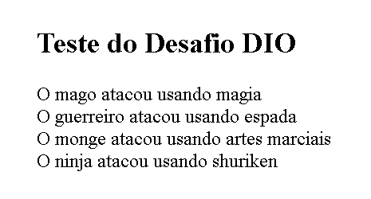

# Escrevendo_as_Classes_de_Um_Jogo_Logica.
## Desafio DIO: **Escrevendo as classes de um Jogo**.
Projeto desenvolvido para a `Formação Lógica de Programação` da [Digital Innovation One (DIO)](https://www.dio.me/).
---
## 📌 Objetivo:
- Colocar em Prática as habilidades do curso.
- Criar uma classe genérica que represente um herói que possua as seguintes propriedades:

- `nome`
- `idade`
- `tipo`
- Ex: `guerreiro`, `mago`, `monge`, `ninja`.
--- 
## 🛠️ Tecnologias Utilizadas
- JavaScript.
- Conceitos de `Programação Orientada a Objetos` (Classes e Objetos).
- Estruturas condicionais (`if / else`).
- Laço de repetição (`for`).
- Operador de comparação (`===`).
- Console do site W3Schools.
---
## 🚀 Como executar
- 🧪 Testar Online no site **W3schools**.

 **Como rodar:** Cole o código no arquivo `index.js` do projeto dentro da estrutura `HTML`,
 👉 [Clique aqui para abrir o Editor da W3Schools](https://www.w3schools.com/js/tryit.asp?filename=tryjs_myfirst),
dentro das tags:
 ****
No lado esquerdo e clique no botão verde **Run**. O resultado dos ataques aparecerá na tela do lado direito!

---
## 📷 Resultado da Execução

---
